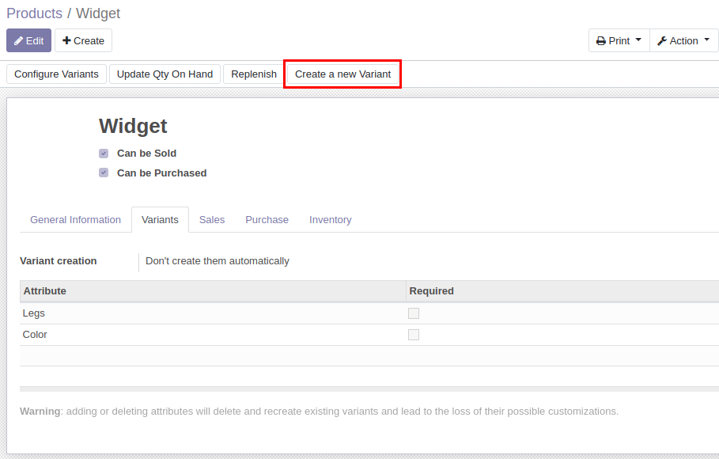
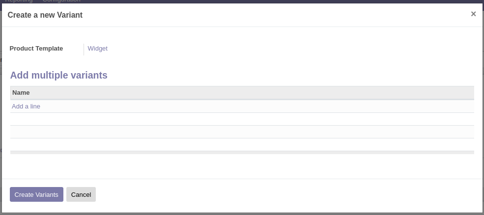
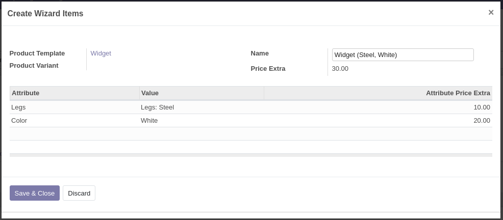

* Create a new Product Template and set the value of Variant Creation to either *Don't create them automatically* or *Use the category value* and make sure the category value of don't create variants automatically is set to True
* Click on create new variants:

* Add as all the variants that you want to create

* Variants will be created and registered in the system
